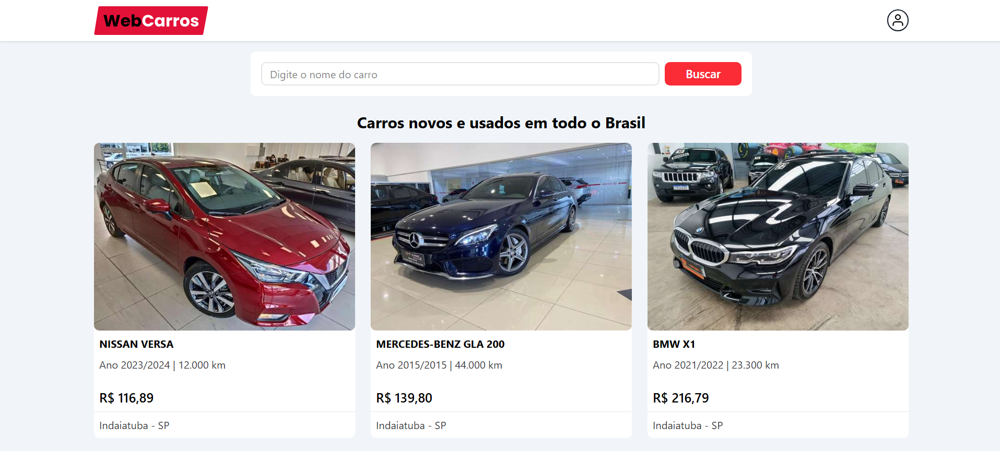
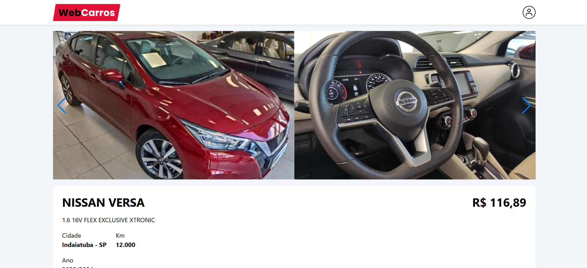
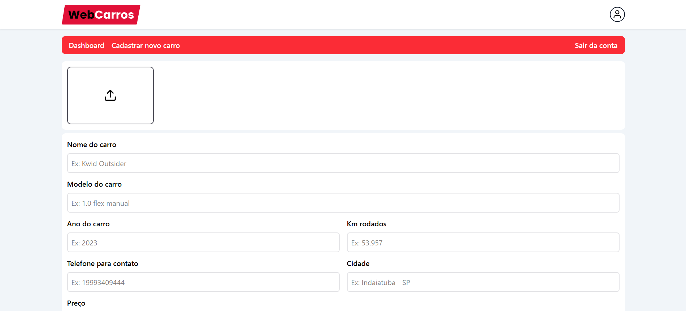

# 🚗 WebCarros - Plataforma de Anúncios de Veículos

WebCarros é uma plataforma web moderna para anúncios de veículos, desenvolvida com React, TypeScript e Firebase. O sistema permite que usuários cadastrem, visualizem e gerenciem anúncios de veículos de forma intuitiva e responsiva.

## 🔗 Acesse o Projeto

[https://webcarros-eight.vercel.app/](https://webcarros-eight.vercel.app/)

## 📸 Screenshots

### Página Inicial



### Dashboard


### Detalhes do Veículo



### Cadastro de Veículo



## 🚀 Tecnologias Utilizadas

- React.js
- TypeScript
- Firebase (Firestore, Storage)
- React Router DOM
- React Icons
- React Hook Form
- Zod (Validação)
- Tailwind CSS
- Swiper (Slider de imagens)

## 📁 Estrutura do Projeto

```
webcarros/
├── src/
│   ├── components/         # Componentes reutilizáveis
│   │   ├── container/     # Container principal
│   │   ├── header/        # Cabeçalho
│   │   ├── dashboardheader/ # Cabeçalho do dashboard
│   │   └── input/         # Componente de input
│   ├── contexts/          # Contextos React
│   │   └── AuthContext/   # Contexto de autenticação
│   ├── pages/             # Páginas da aplicação
│   │   ├── car/          # Detalhes do veículo
│   │   ├── dashboard/    # Painel do usuário
│   │   ├── home/         # Página inicial
│   │   └── register/     # Registro de usuário
│   ├── services/         # Serviços externos
│   │   └── firebaseConnection/ # Configuração do Firebase
│   └── styles/           # Estilos globais
├── public/               # Arquivos públicos
└── package.json         # Dependências e scripts
```

## ⚙️ Funcionalidades

- 🔐 Autenticação de usuários
- 📝 Cadastro de veículos com múltiplas imagens
- 🔍 Busca e filtragem de veículos
- 📱 Interface responsiva
- 💬 Integração com WhatsApp para contato
- 📊 Dashboard para gerenciamento de anúncios
- 🔄 Upload de imagens com preview
- ✅ Validação de formulários
- 🎨 Design moderno e intuitivo

## 🛠️ Como Executar

1. Clone o repositório:

```bash
git clone https://github.com/fcdias0812/webcarros.git
```

2. Instale as dependências:

```bash
cd webcarros
npm install
```

3. Configure as variáveis de ambiente:
   Crie um arquivo `.env` na raiz do projeto com as configurações do Firebase:

```
REACT_APP_API_KEY=sua_api_key
REACT_APP_AUTH_DOMAIN=seu_auth_domain
REACT_APP_PROJECT_ID=seu_project_id
REACT_APP_STORAGE_BUCKET=seu_storage_bucket
REACT_APP_MESSAGING_SENDER_ID=seu_messaging_sender_id
REACT_APP_APP_ID=seu_app_id
```

4. Execute o projeto:

```bash
npm run dev
```

O projeto estará disponível em `http://localhost:5173`

## 🔧 Configuração do Firebase

1. Crie um projeto no [Firebase Console](https://console.firebase.google.com)
2. Ative a autenticação por email/senha
3. Crie um banco de dados Firestore
4. Configure o Storage para upload de imagens
5. Copie as credenciais do projeto para o arquivo `.env`

## 📝 Licença

Este projeto está sob a licença MIT. Veja o arquivo [LICENSE](LICENSE) para mais detalhes.

## 👥 Contribuição

1. Faça um Fork do projeto
2. Crie uma Branch para sua Feature (`git checkout -b feature/AmazingFeature`)
3. Faça o Commit das suas mudanças (`git commit -m 'Add some AmazingFeature'`)
4. Faça o Push para a Branch (`git push origin feature/AmazingFeature`)
5. Abra um Pull Request

## 📧 Contato

Fabrício Dias - [@fcdias0812](https://www.linkedin.com/in/fcdias0812/) - dias.fabricio0812@gmail.com
